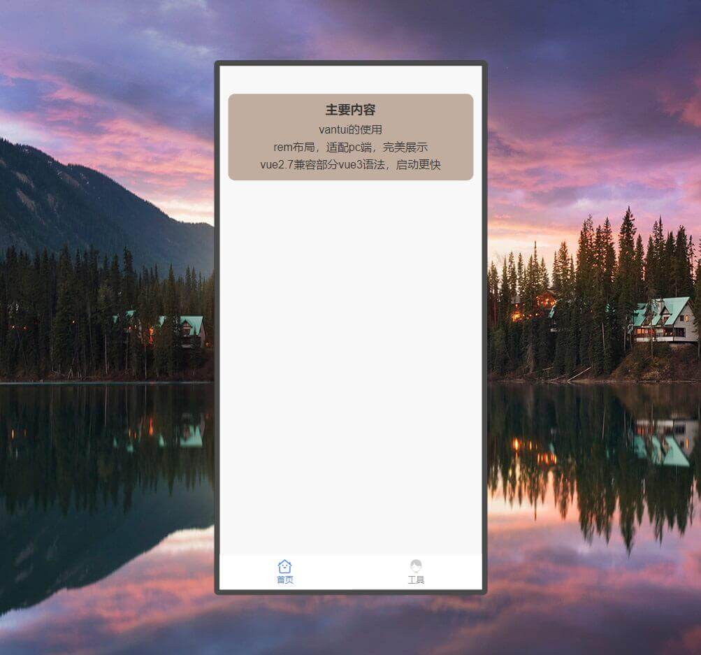

### 简介
vue2.7移动端，兼容部分vue3语法，启动更快，rem布局，判断设备适配pc端，完美展示，还在完善中

### 平台
h5

### 技术栈
vue2，vant

### 邮箱
有问题可以提Issue，或者发邮件：249042680@qq.com，觉得不错可以点个赞

### 仓库
[gitee](https://gitee.com/kangleyunju/vue2_h5)

[github](https://github.com/kangleyunju/vue2_h5)

### 网址
https://static-2503170c-6f74-4217-ac1a-43133fb6d1b4.bspapp.com/vue2_h5

### 下载
```
npm install
```
### 运行
```
npm run serve
npm run dev
```

### 打包
```
npm run build
```

### 依赖说明
* 在pc端自动将mouse事件转换为touch事件，轮播图滑动等
```
npm i @vant/touch-emulator
```
* 默认的省市区数据
```
npm i @vant/area-data
```

### 截图
